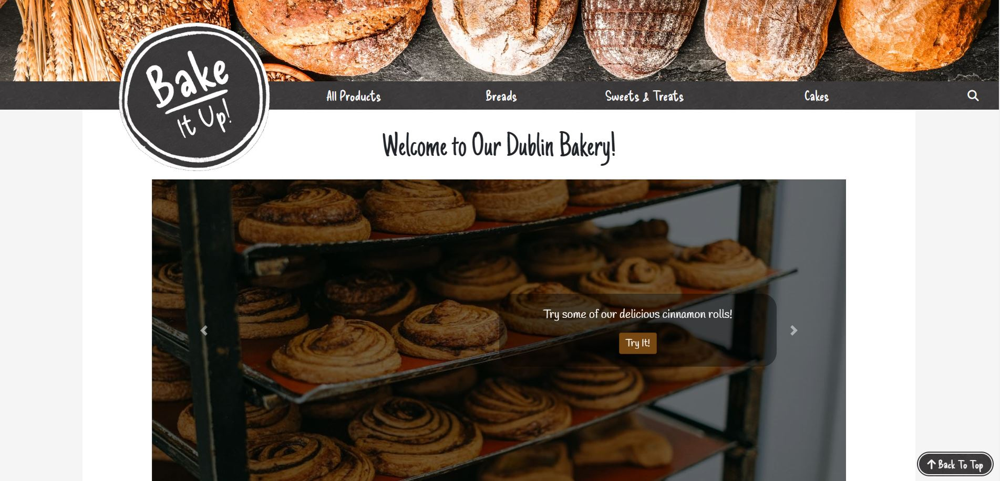

# Bake It Up

## Introduction

Bake It Up is a concept of a bakery based in Dublin where customers have the option to place orders for bread, pastries and cakes, with the ability to alter the properties of their goods to their liking. The aim of the website is to provide an online platform that allows its user's access to the same range of possibilities as they would be given if they were to place their order in-store, along with fully automating the commercial process, from accepting payments to compiling a list of orders for the day.

This e-commerce website was produced using Stripe Payments and the Django framework, and was designed with the help of Bootstrap.

## Design Thinking Process

> *"Why would a user want to visit our website?"*

- To make an order of bread, pastries and/or cakes online
- To view more information 

> *"What would make them return?"*

- A user-friendly website that makes the ordering process as simple and pain-free as possible
- An assortment of controls and options to change their orders where they see fit
- An wide variety of high-quality products made to their standards

### Problem Statement

*"How can we fully transfer the creative freedoms that our in-person patrons have into the online world?"*

### Solutions

## Features

## Design

### User Interface

### Content Layout

### Color Scheme

### Typography

### Wireframes

## Business Model

## Search Engine Optimization

### Keywords

### "sitemap.xml" and "robots.txt" Files

## Web Marketing

### Newsletter

### Facebook Page

### Instagram Page

## Agile Methodologies

## Data Models

### CRUD Functionality

## Testing

### Bugs

### Error Handling

#### 404 Page

#### 500 Page

### Manual Testing

### Automated Testing

### Browser Testing

## Validation

### W3C HTML

### W3C CSS

### JSHint

### PEP8

### Lighthouse

## Deployment and Local Development

### Deployment to Heroku

### Cloning Repositories

### Forking Repositories

## Credits

### Code Snippets/Tutorials

### Media