# Bake It Up

## Introduction

Bake It Up is a concept of a bakery based in Dublin where customers have the option to place orders for bread, pastries and cakes, with the ability to alter the properties of their goods to their liking. The aim of the website is to provide an online platform that allows its user's access to the same range of possibilities as they would be given if they were to place their order in-store, along with fully automating the commercial process, from accepting payments to compiling a list of orders for the day.

This e-commerce website was produced using Stripe Payments and the Django framework, and was designed with the help of Bootstrap.

## Design Thinking Process

> *"Why would a user want to visit our website?"*

- To make an order of bread, pastries and/or cakes online
- To get more information about the bakery

> *"What would make them return?"*

- A user-friendly website that makes the ordering process as simple and pain-free as possible
- An assortment of controls and options to change their orders where they see fit

### Problem Statement

*"How can we fully transfer the creative freedoms that our in-person patrons have into the online world?"*

### Solutions

> *"Why would a user want to visit our website?"*

- To make an order of bread, pastries and/or cakes online
  - Bake It Up's products are easily accessible throughout the site, with each category of products situated within the navigation at the top of the page
  - Products can be filtered by category, searched using a query, and sorted by their name, price, and number of favourites, in ascending or descending order. This makes finding products much easier as users can simply input their most desired features they are looking for in their products
  - Logged in users can also add products to their favourites, as well as filter products to only display their favourites, which is extremely useful for regular customers regularly buying their usual items, as they don't need to navigate through the products they know they don't want
- To get more information about the bakery
  - Upon entering the site, users are greeted with an array of images in the form of a carousel, in order to display a high volume of information distributed in an easy-to-read manner, while also taking up minimal space
  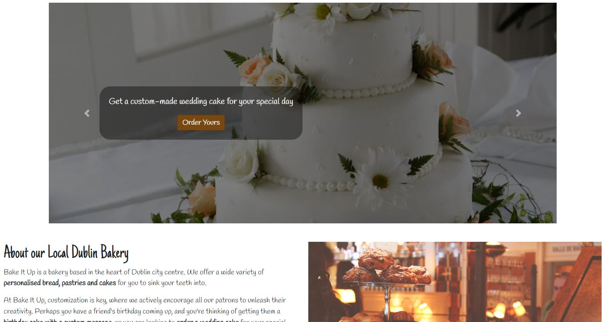
  - Each image in the carousel is accompanied with a short sentence and a CTA button, allowing the users to directly maneuver to the part of the site that peaks their interest
  - The details about the physical bakery are present in the footer of every page. This is a general standard for most business websites. Here, users can find information about the address of the business, their phone number, email address and opening hours.

> *"What would make them return?"*

- A user-friendly website that makes the ordering process as simple and pain-free as possible
  - As described above, adding products to the user's cart is designed to be as straightforward as possible
  - Once the user is happy with their order, the process of checking out is also simple, hiding the delivery section behind a checkbox to prevent an overwhelming clutter of inputs for users not looking to have their products delivered
  - Logged in users can save their information to their profile, making their next order even easier as they no longer have to fill out their details again
- An assortment of controls and options to change their orders where they see fit
  - Every product can have multiple properties attached to it. These properties for each category are as follows:
    - **Bread**: shape, size and contents
    - **Pastries**: type, contents, colour, icing, decoration and text
  - Pastry products have more options because they are more complex than breads, and can be made of multiple parts and can have differnt layers
  - These properties have been implemented to only be a guideline, and can be freely edited to say whatever is applicable to the product

## Features

### Home Page

- The home page is the first thing that users see upon entering the site. It gives a short description about the company, what it does and its origins. This gives the users a brief insight into the personality of the bakery, allowing the bakery to display their interest in their craft, further highlighting the quality of their products

- Users who continue to read into the history are then brought to a short list of their most popular products

## Design

### User Interface

### Content Layout

### Color Scheme

### Typography

### Wireframes

## Business Model

## Search Engine Optimization

### Keywords

### "sitemap.xml" and "robots.txt" Files

## Web Marketing

### Newsletter

### Facebook Page

### Instagram Page

## Agile Methodologies

Bake It Up was developed using an Agile methodology

- All areas of the site were planned out in the beginning of the development, in the form of *user stories*, which are abilities that users of the site are able to use

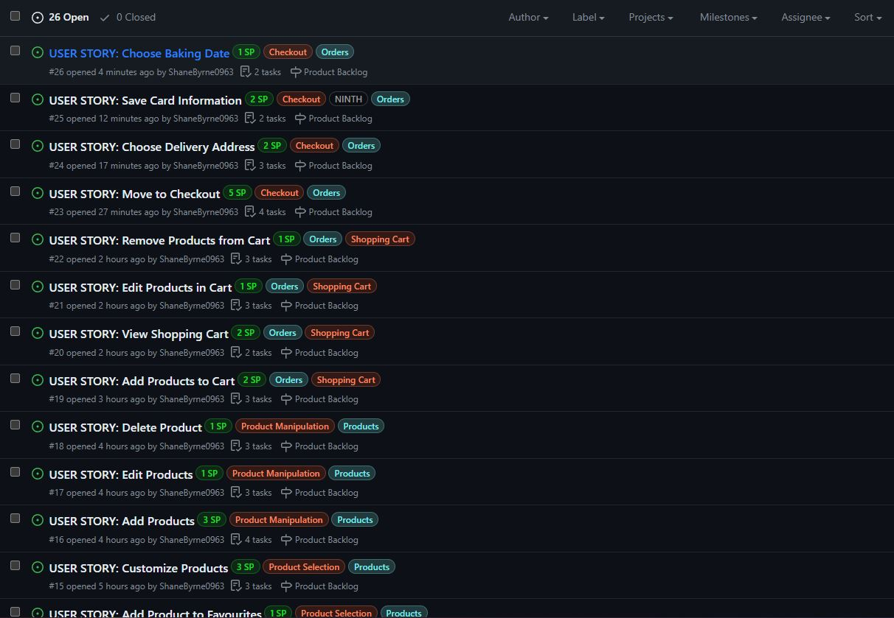

- Contrary to a standard task found in waterfall development, a user story also explains the purpose of that task, and why it would be useful for a user of the site. It takes the form of:
  > *"As a **role**, I can **ability** so that **purpose**"*
  Where:
    - **Role**: The type of user engaging with the site. I mainly used "User" (meaning customer) and "Site Administrator" (meaning person(s) responsible for running the site)
    - **Ability**: The feature of the site the user story is referring to. For example: "View my shopping cart"
    - **Purpose**: The reason the feature should exist. If no valid reason can be found, then the time spent implementing this feature could be better spent elsewhere. For example: for my "View my shopping cart" ability the purpose would be that "I can see all the products I have ordered"

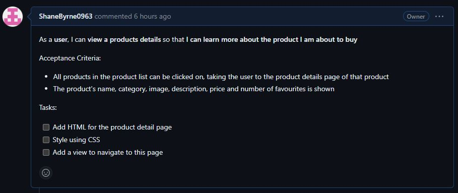

- User stories also have other properties, such as:
  - **Epics**: This is a form of grouping of similar user stories. For example: the user story "Log in to my account" would belong to the epic "Authentication". Epics were assigned to user stories through the use of *orange* coloured labels
  - **Themes**: This is a more broad type of user story grouping, which groups epics together. For example, the epic "Authentication" would belong to the theme "Accounts". Themes were assigned to user stories through the use of *cyan* coloured labels
  - **Story Points**: These are numbers assigned to user stories that give a rough estimation of how long it would take to complete that user story. There is no fixed time to measure these points, but instead, the best method would be to compare them to other user stories. Story points were assigned to user stories in the form of *green* coloured labels

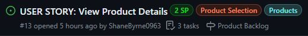

- The development cycle of the website was broken down into week-long timelines called *iterations*. Each iteration had a set list of user stories that were aimed to be completed by the end of that iteration
- Each user story assigned to the iteration was given one of three labels:
  - "Must Have": This user story is required to be completed during this iteration
  - "Should Have": This user story is not required, but it is recommended to complete this within the iteration
  - "Could Have": This user story is not required, but if all other user stories are completed, try to complete these
- "Must Have" user story points must not exceed 60% of the total amount of story points in an iteration
- Bake It Up took 6 iterations to complete all the user stories

View all iterations for Bake It Up

  ### Iteration 1
  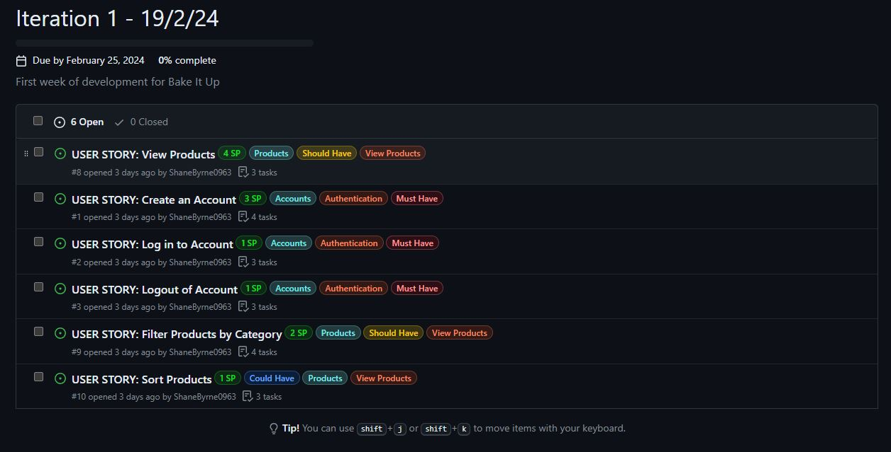
  
  ### Iteration 2
  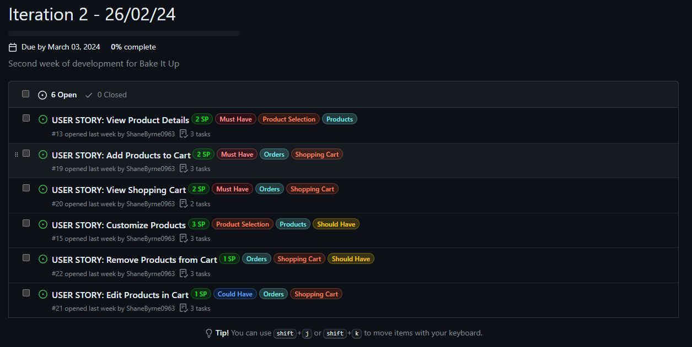

  ### Iteration 3
  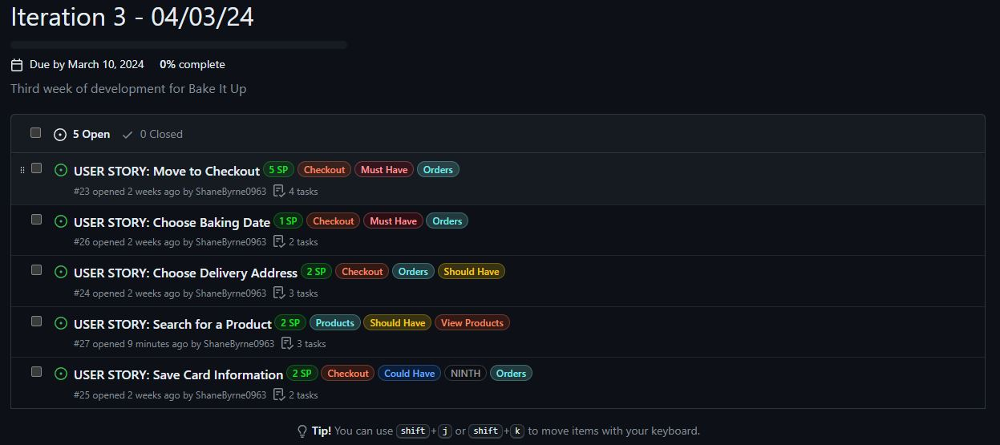

  ### Iteration 4
  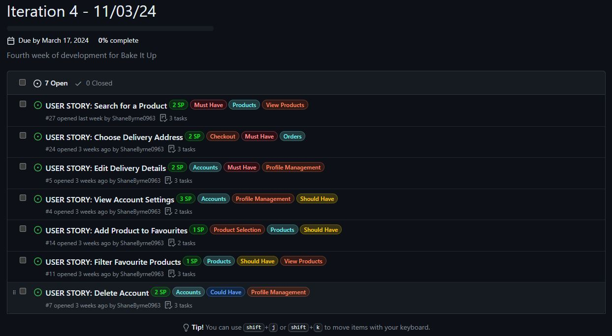

  ### Iteration 5
  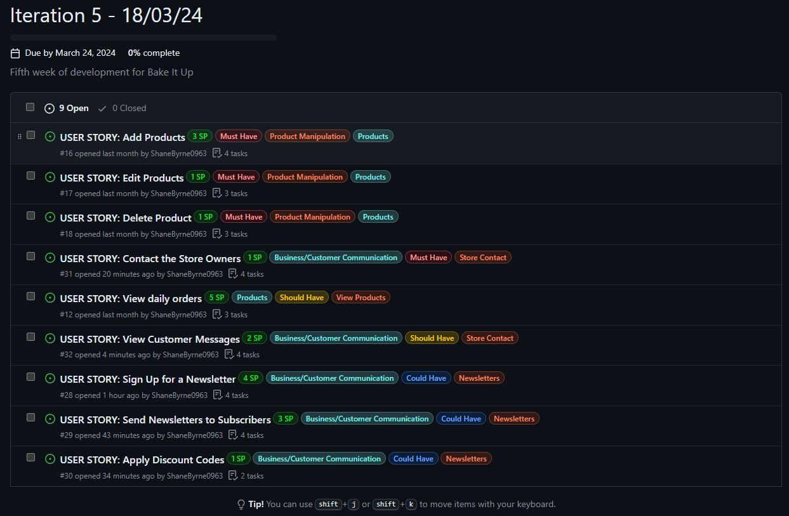

  ### Iteration 6
  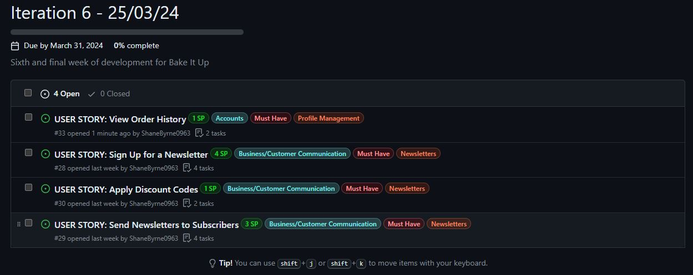

- Some user stories had an extra label, "NINTH" (short for Not Important, Nice To Have), which was reserved for extra features that were not fundamental to the website

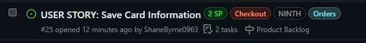

- Throughout the development process, some of these "NINTH" user stories were decided to be removed outright from the final project. Instead of deleting these, I decided to label these user stories with the label "Won't Have", meaning they would not be implemented into the final product

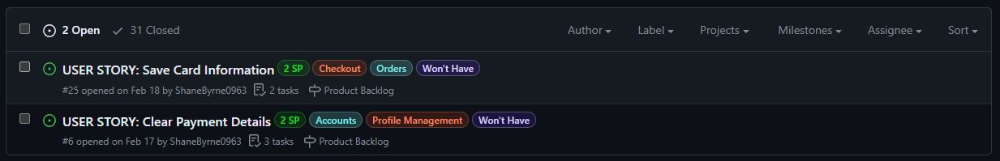

## Data Models

### CRUD Functionality

## Testing

### Bugs

### Error Handling

#### 404 Page

#### 500 Page

### Manual Testing

### Automated Testing

### Browser Testing

## Validation

### W3C HTML

### W3C CSS

### JSHint

### PEP8

### Lighthouse

## Deployment and Local Development

### Deployment to Heroku

### Cloning Repositories

### Forking Repositories

## Other points to note

### Naming conventions

## Credits

### Code Snippets/Tutorials

### Media