# Bake It Up

## Introduction

Bake It Up is a concept of a bakery based in Dublin where customers have the option to place orders for bread, pastries and cakes, with the ability to alter the properties of their goods to their liking. The aim of the website is to provide an online platform that allows its user's access to the same range of possibilities as they would be given if they were to place their order in-store, along with fully automating the commercial process, from accepting payments to compiling a list of orders for the day.

This e-commerce website was produced using Stripe Payments and the Django framework, and was designed with the help of Bootstrap.

## Design Thinking Process

> *"Why would a user want to visit our website?"*

- To make an order of bread, pastries and/or cakes online
- To get more information about the bakery

> *"What would make them return?"*

- A user-friendly website that makes the ordering process as simple and pain-free as possible
- An assortment of controls and options to change their orders where they see fit

### Problem Statement

*"How can we fully transfer the creative freedoms that our in-person patrons have into the online world?"*

### Solutions

> *"Why would a user want to visit our website?"*

- To make an order of bread, pastries and/or cakes online
  - Bake It Up's products are easily accessible throughout the site, with each category of products situated within the navigation at the top of the page
  - Products can be filtered by category, searched using a query, and sorted by their name, price, and number of favourites, in ascending or descending order. This makes finding products much easier as users can simply input their most desired features they are looking for in their products
  - Logged in users can also add products to their favourites, as well as filter products to only display their favourites, which is extremely useful for regular customers regularly buying their usual items, as they don't need to navigate through the products they know they don't want
- To get more information about the bakery
  - Upon entering the site, users are greeted with an array of images in the form of a carousel, in order to display a high volume of information distributed in an easy-to-read manner, while also taking up minimal space
  
  - Each image in the carousel is accompanied with a short sentence and a CTA button, allowing the users to directly maneuver to the part of the site that peaks their interest
  - The details about the physical bakery are present in the footer of every page. This is a general standard for most business websites. Here, users can find information about the address of the business, their phone number, email address and opening hours.

> *"What would make them return?"*

- A user-friendly website that makes the ordering process as simple and pain-free as possible
  - As described above, adding products to the user's cart is designed to be as straightforward as possible
  - Once the user is happy with their order, the process of checking out is also simple, hiding the delivery section behind a checkbox to prevent an overwhelming clutter of inputs for users not looking to have their products delivered
  - Logged in users can save their information to their profile, making their next order even easier as they no longer have to fill out their details again
- An assortment of controls and options to change their orders where they see fit
  - Every product can have multiple properties attached to it. These properties for each category are as follows:
    - **Bread**: shape, size and contents
    - **Pastries**: type, contents, colour, icing, decoration and text
  - Pastry products have more options because they are more complex than breads, and can be made of multiple parts and can have differnt layers
  - These properties have been implemented to only be a guideline, and can be freely edited to say whatever is applicable to the product

## Features

<strong>Authentication</strong>

- Unauthenticated users have two buttons present in the top-right corner of the screen, used for logging in and signing up

Login

- Clicking the login button causes a modal to appear, requesting an email address and a password of a user.
- Users can request the website to remember their login so they don't have to keep repeatingly log in each time they enter the site

- Upon entering valid login details, users are logged in, with a toast message confirming the success, and the login and signup buttons being replaced with a profile icon dropdown

- If invalid details are provided, the user is notified through the modal. Giving feedback ensures the user about what went wrong rather than assuming the website had a server error

- If the user forgets their password, they can click the "Forgot your password?" link in the login modal, taking them to a page to enter the email of the account with the lost password

 

- Upon entering the email, a validation link is sent to the email address, which, when clicked, takes the user to a page to enter a new password

Signup

- When the user clicks the signup page, the signup modal appears, requesting an email, a password validated by being entered twice, and an optional first and last name

- Entering invalid details will give feedback for each invalid input, with the reason why the signup failed. This allows the user to easily evaluate the errors and make corrections where necessary

- If the user signs up with valid information, a confirmation email is sent to the given email address. This is done to ensure that the email address actually belongs to the user

- The email contains a link to activate their account. When activated, the user can freely use their account

Logout

- Authenticated users can always log out through the profile dropdown. The ability to log out is critical to keep the user's information secure if they were to log in on a public device

- When a logout is attempted, a confirmation modal will first appear asking the user for confirmation that the logout is intentional. This avoids any misclicks logging the user out, and making the user have to go through the process of logging in again

 

<strong>The Home Page</strong>

- The home page is the first thing that users see upon entering the site. It gives a short description about the company, what it does and its origins. This gives the users a brief insight into the personality of the bakery, allowing the bakery to display their interest in their craft, further highlighting the quality of their products

- Users who continue to read into the history are then brought to a short list of their most popular products once they are finished reading. This is to continue the flow of the website and make the user return to the primary reason to view the site, shopping for products
- A link is beneath these products to take them to the full list of products, guiding the users back into the shopping phase of exploring the site

- For users already familiar with the site, or who just want to shop without finding out more about the bakery, they can jump straight into the action using the navigation bar

<strong>Product Lists</strong>

This is where the user can see on full display everything the bakery has to offer. The products take the shape of a card, containing its name, image, category, batch size (if applicable), number of favourites and the price per unit, displayed in a neat, easy to interpret manner

The lists can be arranged in multiple different ways:

<strong>Categories</strong>

- Products can belong to 3 different categories:
  - Freshly Baked Bread
  - Sweets & Treats
  - Custom Cakes
- These categories can be found in the top navigation, as well as a combination to view all products. Categorising products in this way makes it significantly helpful to users who know the type of bakery product they are looking for, and is the most efficient method to maneuver through the products as applying this filter only takes one click 

- The categories can also be filtered using the filter inputs above the product list. This filter functions similarly to the navigation categories, but if the user applies any other queries, such as a search or sort, here these queries persist, whereas if the user selects a category from the navigation, all previous queries are cleared. I decided to implement this feature to diversify the way products can be searched for, allowing users to easily get rid of queries they no longer wish to use

<strong>Product Search</strong>

- Located at the end of the navigation bar, the search icon can be clicked to reveal a search bar, where the user can enter a specific term to search for within the products

- When a user enters something, the database will be searched for any product whose name or description contains that query
- If the query is present in the product's name, then the query is highlighted, making it easier for the user see the query they entered in the context of the product

<strong>Filter By Favourites</strong>

- For authenticated users, a heart icon will appear beside the filter inputs. When clicked, this icon will toggle, and if solid (on), only the products that the user has added to their favourites will show. This allows the user to easily find the products they are familiar with, without having to wade through the items they are not interested in

- For ease of access, this filter can be accessed through the user's profile icon dropdown menu

<strong>Sort Products</strong>

- Along with filtering products, users can also sort their products in several ways:
  - Number of favourites
  - Alphabetically
  - By price
- Each sort can be applied in ascending or descending order. This gives the user more power to find products based on their attributes, such as if a user has a budget, they can look for the cheapest products by sorting by price in ascending order
- These sorts can also be mixed with filters and queries
- The default sort is by number of favourites in descending order, so the most popular products are displayed first

- If a user enters a specific filter which results in no products found, an error message explaining the fact is presented instead, offering a link to clear the user's criteria so they are able to see products again

<strong>Products</strong>

- When the user decides on a product, clicking on the product card will take them to a page describing the product in more detail.
- Here, the user can see everything they could see in its card form, but its description and ingredients are present on top of that

- Beside the product name, another heart icon is present, that when clicked on, toggles between solid and outline, where solid means the user has this product in their list of favourites, and an outline means it doesn't
- The heart icon is an exact copy of the heart icon found in the filter inputs in the product list page, which makes it easy for the user to determine that the two are connected

- Below the information about the product, a list of properties can exist, and varies heavily depending on the product. This is where Bake It Up stands out from the crows, as the user can customise the properties of the products they are ordering.

- The property inputs come in 4 different forms:
  - A checkbox, when only one property can be chosen from
  - A button radio group, when between 2 and 4 properties can be selected from
  - A select dropdown, when 5 or more properties are present
  - A colour picker, for the colour property that can be given to pastries
  - A textarea field, 

  

- Products can take 2 forms: Bread and Pastry. Cake is shared with the Pastry model
- These use different models as they share different properties
- The Bread model conatins the following properties:
  - Shape
  - Size
  - Contents
- The Pastry model contains the following properties:
  - Type
  - Contents
  - Colour
  - Icing
  - Decoration
  - Text
- These property names are simply there as a guideline. All labels can be customised to suit the property in the product's context, giving full control to the admins on how to describe their products

- All of these properties function the same, except for the colour and the text inputs.
  - The colour picker uses a colour picker, which functions similarly to the button group, except the colour picker does not have a limit on the number of products to add.
  - The text input allows the user to enter a custom message. This is mainly present on cake products, where the user can have a message written on the cake

- These attributes use a JSON field for both models. I decided to not limit the number of values that can be applied to a property, because the ability to add products is a feature exclusive to members of staff, who will not exploit this ability. Furthermore, I wanted to make sure that there are no limitations to what the website can offer its customers, allowing the same freedoms as if the products were ordered in-store

- Below the product property form is a quantity selector. This allows the user to enter the number of this product they are looking for. This reduces the need to enter the properties repeatedly if the user requires more than one of the same product
- The total price updates when the quantity changes, allowing the user to easily evaluate the cost before adding it to the cart

<strong>Shopping Cart</strong>

- When a user selects a product and quantity, this item is added to the user's shopping cart. An icon will appear in the top-right corner of the screen, labelled with a cart icon and the total cost of the cart.

- When clicked on, the user is taken to the shopping cart page, where they can see an overview of the products they have ordered
- For each product, the user can see the same details in the product list (except for the number of favourites), the properties they have selected for that product, the quantity of that specific product and the subtotal cost of it

- The same product can exist multiple times in the cart if the product properties are different
- However, if the same product with the exact same properties is added to the cart multiple times, the products will stack together into the one line. This prevents the cart getting cluttered with repeating products

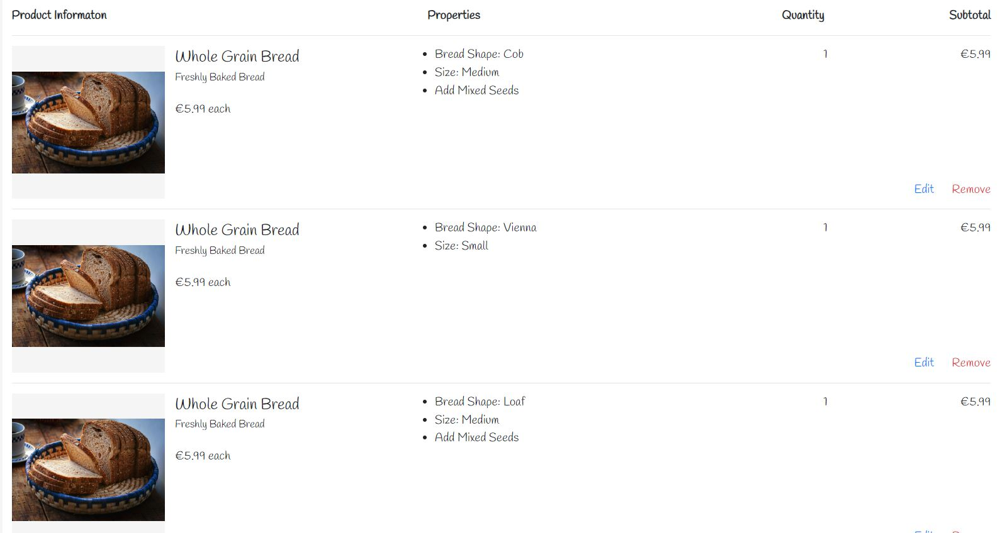

- The user has the option to edit each product in their cart, or remove it entirely. This allows users to make changes to their cart in case they change their mind about something
- If deleting a product, a modal appears confirming the user meant to perform the action. This kind of defensive action prevents any unwanted mistakes happening from misclicks

- When the user has looked through their order, below the list of products, they are presented with the final details of the order, made up of the cart total, an optional customer message and the bake date selector.
- The cart total reminds the user of the total amount the cart costs as listed in the cart icon at the top of the page.

- The customer messgae input allows the user to add any details to the order. This will be visible to the administrators when they are working on the order, giving the user a platform to add any specifics such as dietary requirements or special requests.

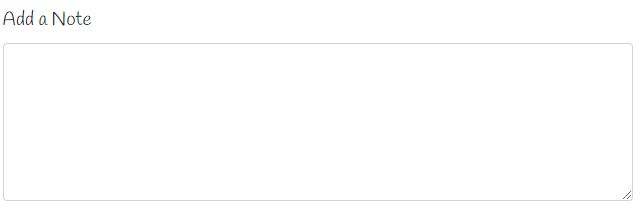

- Along with the customer message input, a date input indicating the date the goods will be baked on is also present.
- If the time is before the cutoff time (In this case 4pm), the user has the option to have their products baked on the next day. This gives the bakery time to get their orders ready.

- However, if the user were to order their products after this time, they are required to order their products to be made in at least 2 days

- If a user passes the cutoff point while in the cart/checkout page, they will be brought back to the cart page to confirm the date change. This prevents users from waiting past the point and ordering their products for the next day, long after the time for that to be possible has passed

<strong>Checkout</strong>

- Upon adding products to their cart, and selecting a baking date, the user is taken to the checkout page. Here, they enter their information which is used to process their order, which is as follows:
  - Full name
  - Email address
  - Phone number
  - Address
  - Postcode

- Authenticated users can choose to have their information saved to their profile, so that they don't have enter their details again when placing another order

- Users have the option to deliver their goods to their address. By default, the billing details entered above are used, ensuring the user doesn't have to enter the same information twice
- The delivery cost added to the total depends on the county the user has selected. The further from Dublin (The home of Bake It Up) the more expensive the delivery charge is

- If the user's delivery address is different to their billing address, they can select a checkbox to deliver to another address, where another section of the form appears, requiring the same address inputs as in the billing details

- To the right of the screen, the order summary is shown, giving the cart total, the delivery cost (if applicable), and the order total. Underneath this summary is the button to proceed to the payment
- This section follows the user as they scroll down the page, so that the user doesn't have to scroll back up when they have completed their order

- Above this summary, the user has the option to enter a discount code they may have received from a newsletter
- If the code is valid, a discount will be applied to the cart total, and will appear beneath the cart total in the order summary

- When the user has filled out all their details, they can proceed to the payment section, which takes the form of a modal appearing in front of the screen.
- This modal contains four Stripe elements:
  - **Card Number**: The 16 digit number on a person's card
  - **Expiration Date**: The date of expiry on the card
  - **CVC**: The 3 digit number found on the back of a card
  - **Postcode**: A 5 digit postcode
- When filled out, the details are posted to Stripes payment intent using *Asynchronous JavaScript and XML* (AJAX) and, if valid, completes the payment and submits the order to the database
- If a problem occurs on the user's end, such as closing the page during the payment or timing out, the order is processed anyway by using Stripe's payment intent's webhooks to create an order if one is not found

- On a successful payment, the user is taken to the checkout success page, where they can view a summary of the order, including:
  - The order number to reference the order
  - The bake date and customer message
  - The list of products and their properties
  - The billing information
  - The shipping information, if any
- Below the summary, there is a link to return to the home page, so that the user is given a direction on where to go next

- Simultaneously, a confirmation email is sent to the email address specified in the checkout page, giving unauthenticated users access to the order history for reference

<strong>Account Settings</strong>

- Authenticated users can navigate to their account settings page within the profile dropdown menu on the top right of the screen

- This page consists of the following:
  - Saved contact/billing details
  - Order History
  - Any discounts received from a newsletter
  - An option to unsubscribe from the newsletter, if their email is subscribed
  - An option to permanently delete their account

- Users can add, update or remove their contact and billing details if desired by clicking on the "Edit" button under these headings
- When this button is clicked, the list is replaced with a form and a submit button

- Users can edit their email address, but as this is the method to log in, a modal appears requesting the user's password in order to continue with the update. This is done to prevent anyone might have gained access to the account from locking the user out of the account
- The modal warns the user that the account will become locked, and the account will have to be reauthenticated like the user had to on creating the account

- Once authenticated, the user will be logged out, and a verification email will be sent to the new email address to reactivate the account

- The user can also view their order history on this page. A card with the order number and order date labels each order, and can be clicked on to take the user to the summary of that specific order

- This order summary is an exact copy of the checkout success pages details, with the exception of 2 links, above and below the summary, to return the user to their profile.

- If the user' email is subscribed to the newsletter, they can view their available discount codes, as well as unsubscribe from the newsletter.

- Users can also delete their account if they desire. However, considering this is an irreversible action, in a similar fashion to the the email edit, a modal appears asking the user to confirm the action py providing their password
- Once a password is provided, the account is successfully deleted

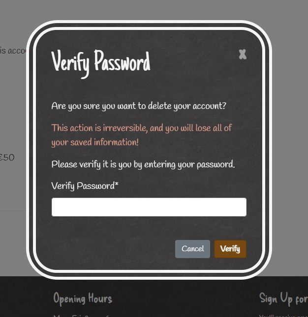

<strong>Store Contact</strong>

- Located in the footer of the website, users can contact the store by navigating to the "Contact Us" page.
- This page simply is made up of a form, comprised of an email, a message, and an optional name and title for the message. This allows the users to send any feedback or ask any questions in a quick manner
- The page also gives other methods of contacting them, to give more freedom to the users on how they approach the bakery and to demonstrate the willingness of the bakery to communicate with its customers
- When the user submits the form, a message is created and stored in the database, where the admins will get notified of it

- In the carousel, there is an action to order a wedding cake. When the user clicks this action, they are taken to this page, and the context of the page changes to better suit the situation of ordering a wedding cake. This is done to make it more clear what the user need to enter to order their wedding cake

- For admins, when a user sends a message, a notification icon appears in the top-right corner of the profile dropdown. Clicking the dropdown will reveal a notification beside the messages link

- This link takes the admin to the messages page, where they can see a list of all messages sent to the bakery
- Messages are divided between read and unread messages, with unread messages placed first, and all messages ordered by most recent

- Clicking on a message reveals the text content, while simultaneously sending a request the server via AJAX to mark the message as read

- Old messages can be deleted, with a defensive confirmation modal to reassure the action is intentional

<strong>"Back To Top" Button</strong>

- When the user scrolls down the page, a "Back To Top" button reveals itself that, when clicked, brings the user back to the top of the page, where it returns out of view
- This is helpful to bring the user back to the navigation rather than manually scrolling to the top of the screen

<strong>View Daily Orders</strong>

- This page can only be accessed by admins through the profile dropdown menu

- This link takes the admin to the "View Orders" page, where they can view a list of all orders placed for a specific day
- The list consists of a summary of all orders, followed by a list of each individual order. I included the summary to give a better understanding on the total amount of each product, allowing the bakers to get an idea of the volume of products they need to make before focusing on the specific properties, rather than having to look through each order to calculate it themselves

- Clicking on a single order will reveal each product attached to that order, including their properties, along with the delivery method and the customer note, if one was given. This is as much as the admins need to handle each order, and no extra unnecessary information is given to make this as easy to digest as possible

- Admins can also view past and future orders by using the date input above the list, so that they can get a better understanding of what they will be making in the future, or need to reference an order in the past

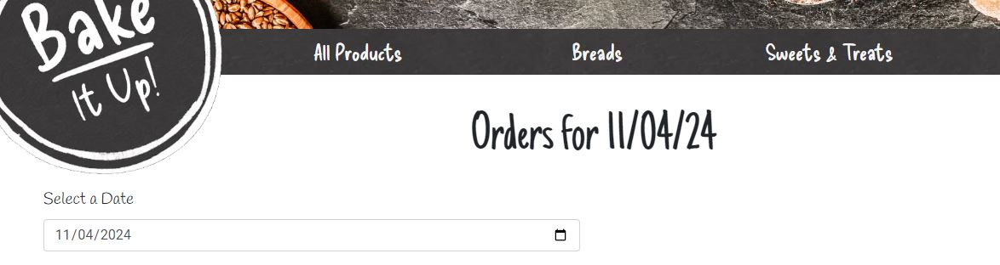

- If no orders are present on a particular date, the admin is notified as such, so that they are not wondering if the site has stopped working

## Design

### Site Layout

- The site uses a base template, which remains the same throughout all pages. This enforces a feeling of familiarity for the user, as the base includes the means to navigate through the site.

<strong>Header/Navigation</strong>

- The page header consists of a hero image, the site owner's logo, a page navigation and a profile actions section

- The hero image exists to visually compliment the look and feel of the site, as it matches the site's colour scheme of gray and orange.
- As the user scrolls down the page, the hero image has a slight perspective movement, moving slightly slower than the rest of the page. This makes the page feel more lively and animated.

- The navigation bar is simple, only involving pages related to products. This prevents users from being drawn away from the main focus of the site: buying the bakery's products.
- The navigation bar has a background that came from the texture of the bakery logo. This allows the logo to sit with it seamlessly without standing out too much

- The four buttons relate to categories of products. Most users would enter the site with the intention of finding a specific type of product, whether it be a loaf of bread, a dessert, or a cake. Having these options readily available from the start is convenient for these users.

- Clicking on the search icon expands a search bar that overlaps the content heading. This bar was kept hidden from users not looking to use it in order to conserve space
- This search bar is made of two double white outlines, a property that is also shared by the bakery logo. This is the general theme of the site, and sticking to it enforces a level of consistency

- For mobile devices, this search bar becomes too small to host the navigation links, so they are instead hidden from view, and moved to a collapsible on the top-left corner of the screen. Clicking on this collapsible reveals all the navigation features desktop users have access to.
- This collapse moves through the collapse icon and the user actions section, but as we still want the user to have access to these, this new section does not overlap them, allowing full access to all user interface elements in a small space

- The bakery logo is the logo that Bake It Up uses for their physical bakery

- This logo sits on top of the navigation, extruding from the flow of the webpage. The design is made to resemble a ribbon-like object, allowing some interpretation that the site is like a gift wrapped up in a bow

- The logo scales with the size of the screen, to make sure it isn't obstructing the rest of the site.
- The site has been programmed to start the main content section just below the logo, so the logo cannot overlap any of the text content

<strong>Footer</strong>

- The footer contains general information pertaining to the website as well as the bakery itself, mostly including information on a lower demand
- It contains the following:
  - The bakery's physical address and contact details
  - The bakery's opening hours
  - A link to subscribe to the newsletter
  - A site navigation, similar to the one in the mobile collapse
  - A link to the "About Us" section of the home page
  - A link to contact the bakery directly
  - A privacy policy
  - Links to the bakery's Facebook and Instagram accounts
- Having a footer is important as it marks the end of the page, without just abruptly ending without any warning
- I included the links to other parts of the website to give the users extra options to continue their navigation, along with using the "Back to Top" button

- The content of the footer is sectioned appropriately, and spread out in an easy to read manner, which reorganises itself seamlessly for smaller screens

<strong>Modal</strong>

- A modal is used to perform and confirm many actions throughout the site. It appears in the center of the screen, with a base comprised of a title, a body, a confirmation button and a cancel button.
- For consistency, the modal uses the same texture as the bakery logo, while also both sharing a double white outline. This is to maintain consistency with the theme of the site, with other components having similar properties

- Modals can also have forms attached to it, which was used to host the login, signup and Stripe payment forms

- For asynchronous actions, such as processing a payment intent, the modal has a loading screen in order to portray to users that their are actions taking place in the backend, and the page has not frozen
- Once this screen is active, users cannot click close the modal, or click on any buttons within it. This is to stop the user from performing the action multiple times while the first process is undergoing

<strong>Toasts</strong>

- Toasts are popup messages that appear to give feedback on a user action, for example, logging out of their account. This visual confirmation leaves the user with no doubt that their action was processed, and any errors will be made known
- On page load, the toast animates its way in from the right hand side of the screen, below the user sction button so it isn't blocked
- Users can manually close these modals, or they will close automatically after a few seconds, so the users don't have to manually close them
- Like the modal, toasts share the same background and double white outlines as the bakery logo, for consistency's sake

- These toast messages can stack, allowing the user to see all of their messages if multiple were given

- Toasts come in 4 different ways:
  - Success: Shown when a user action is successful
  - Info: Used to provide information to the user
  - Warning: Used to warn the user of a potential harmful action
  - Error: Shown when something goes wrong. Is useful for giving feedback
- Having messages grouped into categories like this helps the user to understand better the context of the message

### Colour Scheme

- The colour scheme of the website began by evaluating the company brand logo

- This logo is composed of 2 colours: dark grey and white.
- The texture of the background resembles some sort of stone. I liked this as it could represent the stone-baked nature of Bake It Up's goods, so I decided to extract the texture of it to use throughout the site

- This was decided to be the primary colour of the site, with this texture becoming the background for several sections, including the navigation and footer

- For the secondary colour, I decided to use a brown-hue colour. This leans towards the colour of bread, which suits the theme bakery aspect of the site
- This colour was primarily used for action buttons, such as submitting forms

- These colours are both highlighed well within the hero image

### Typography

- The general theme for the typography is "hand-drawn", which gives the website a more informal and cosy feel
- The website uses 4 different fonts:
  - **Handlee**: This font is the main font of the site, used for main bodies of text
  - **Just Another Hand**: This font is reserved for titles
  - **Delicious Handdrawn**: This is for the navigation buttons and headings within the footer, i.e. for the user interface. It is also the same font that was used for the "Bake It Up" logo, and works very well with the stone-like texture
  - **Roboto**: This is used for form inputs. I decided to use a regular font instead of a "hand-drawn" one for the form inputs as using a hand-drawn one felt very out of place
- Breaking the typography up into sections like this gives more power to differentiate between content

### Wireframes

<strong>Click to reveal wireframes</strong>

#### Base Template

| Desktop | Mobile |
| ------- | ------ |
 | 

#### Page Footer

| Desktop | Mobile |
| ------- | ------ |
 | 

#### Home Page

- Top

| Desktop | Mobile |
| ------- | ------ |
 | 

- Bottom

| Desktop | Mobile |
| ------- | ------ |
 | 

#### Product List

| Desktop | Mobile |
| ------- | ------ |
 | 

#### Product Details

<table><tr><th>Desktop</th><th>Mobile</th></tr><tr>
<td>

</td><td>

- Top

</td></tr></tr><td></td><td>

- Bottom

</td></tr></table>

#### Shopping Cart

| Desktop | Mobile |
| ------- | ------ |
 | 

#### Checkout

| Desktop | Mobile |
| ------- | ------ |
 | 

#### Checkout Success

| Desktop | Mobile |
| ------- | ------ |
 | 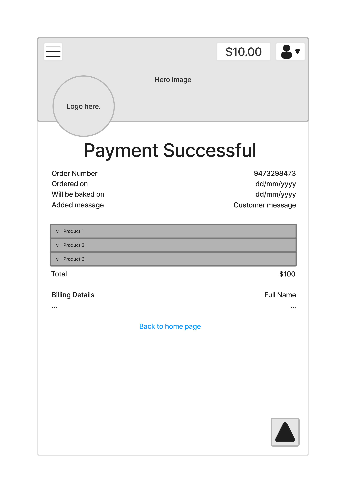

#### Account Settings

| Desktop | Mobile |
| ------- | ------ |
 | 

#### Store Contact

| Desktop | Mobile |
| ------- | ------ |
 | 

#### Customer Messages (Admin)

| Desktop | Mobile |
| ------- | ------ |
 | 

#### Daily Orders (Admin)

| Desktop | Mobile |
| ------- | ------ |
 | 

#### Add Products (Admin)

| Desktop | Mobile |
| ------- | ------ |
 | 

## Business Model

- The bakery has a Business to Customer, and possibly a Business to Business, relationship.
- Because orders vary from day to day, a subscription service would be impractical, so a single payment method is most suitable for this business
- The checkout process, from entering the site to payment, is reduced as much as possible to ensure the customer doesn't leave the site before making a payment. This is done in a number of ways:
  - Easy access to view all products
  - Minimum information required to fill in, no unnecessary required inputs
  - Extra information, such as the bake date and customer message, are included in the shopping cart page rather than their own page, to reduce the number of clicks

## Search Engine Optimization

### Keywords

- To improve the chances of the page appearing higher in search results, I tagged the site with specific keywords. These keywords are general terms that potential users could enter into a search engine, so we want as many of these keywords present on our site as possible, so that the users are more likely to find our site first.
- Keywords can range from short-tail (i.e. "Bakery Dublin") to long-tail (i.e. "Where can I buy a personalised cake")
- The first step was to jot down potential topics, or in other words, the general idea of what the user has in mind when making their search
- The topics I came up with were:
  - Bread
  - Pastries
  - Cakes
  - Local Bakery

- The next step was to brainstorm as many keywords as possible

View Keyword Brainstorming

- Bread:
  - Buy bread online
  - White bread
  - Loaf
  - Whole Grain
  - Baguettes
  - Burger buns
  - French toast bread
  - Sourdough
  - Sour dough
  - Stone baked bread
  - Personalised bread
  - Deliver bread to me
- Pastries
  - Scones
  - Fruit Scones
  - Raisin Scones
  - Fresh croissants near me
  - Fresh Treats
  - Cookies
  - Doughnuts
  - Cupcakes
  - Muffins
  - Brownies
  - Sweets
  - Sweet shop near me
  - Buy pastries online
  - Where to buy red velvet cookies
  - Where to buy buttercream filled cupcakes
- Cakes
  - Birthday cakes
  - Special cakes
  - Custom cake
  - Wedding cakes
  - Buy cake with custom message
  - Order wedding cake online
- Local Bakery
  - Dublin bakery
  - Bakery Wood Quay
  - Local bakery Dublin
  - Dublin bread

- After coming up with as many ideas as possible, it is recommended to search some of these terms, taking note of the results and keeping an eye out for the related terms

- After searching through several keywords, I found several extra related keywords to consider:
  - Freshest ingredients
  - Bread made for me
  - Buy pastries as a gift
  - Cake delivery Dublin
  - Best bakery in Dublin

- Next, the list has to be reduced. Search engines don't like an abundance of keywords as it interprets that as spam-like. Also, you don't want to include keywords that are too specific, such as "Where to buy buttercream filled cupcakes", or too broad, like "Cupcakes"
- With all that in mind, I decided on using the following:
  - Buy bread online
  - Personalised bread
  - Custom bread
  - Gluten-free
  - Fresh Treats
  - Sweet Treats
  - Buy pastries online
  - Cake delivery Dublin
  - Birthday cakes Dublin
  - Wedding cakes Dublin
  - Buy cake with custom message
  - Order wedding cake online
  - Dublin bakery
  - Local Dublin bakery
  - Dublin bread

- To implement these, it is recommended to include them in headings and wrapped in a "strong" or "em" tag within paragraphs. However, the page cannot be "stuffed" with these keywords, as the search engines will detect this and decrease the page's ranking.
- For this reason, I wrote the introduction paragraph of the bakery to include these keywords in a meaningful way, along with only including keywords in headings where it would make sense

- There is another method to include keywords, which is within the "keywords" meta tag in the page's header. The search engines are more lenient to this method, so it is acceptable to put as many keywords as you like here

- Adhering to proper SEO standards maximises the chances of your page being seen by your target audience, so it is vital for the success of the page

### "sitemap.xml" and "robots.txt" Files

The following files were created to further boost the SEO results of this site:
- "sitemap.xml" is a file that gives a list of pages that can be navigated through the site. This allows search engines to understand the structure of the site, and giving them the ability to scan through them efficiently

- "robots.txt" tells the search engines what pages should not be included in the scan of the site. This includes actions that require user actions, such as the shopping cart page, checkout page and profile page. The existence of this file improves the chances of the site appearing higher on the results as it demonstrates to the search engines that the site is willing to be scanned through

## Web Marketing

<strong>Newsletter</strong>

- Instead of relying on an external program to deliver newsletters, admins can send newsletters within the website itself, accessed through the profile dropdown on any page. This was done as there is extra functionality to Bake It Up's newsletter, which includes automatically applying discount codes to its subscribers.
- The user can enter:
  - A subject, which will appear first in the subscriber's inbox
  - A message body, which is where the bulk of the content will be entered
  - A discount code, which will give subscribers a sum of money off of their next order
- A base is provided to give a structure to the newsletter. This includes:
  - A header, indicating that the email is a Bake It Up newsletter, which is accompanied by the date it was sent.
  - A format for the discount code, if applicable
  - A signature
  - A link to unsubscribe to the newsletter

- The newsletter includes a preview that shows how the newsletter will look in the email. This is to prevent any mix-ups between the admin's input and the base format, for example, the admin entering a signature at the bottom of the message when a signature already exists in the template
- This preview updates when the admin changes their message, without the need of any annoying "Generate Preview" buttons 

- A discount code can be added to the newsletter by checking the checkbox to add the discount code. The code inputs are disabled when this box is unchecked to prevent confusion in admins thinking these inputs always have to be filled out.

- Discount codes include a code name, which is what is used to access the code in the checkout page
- Code names must be unique, and cannot contain spaces or special characters other than "-"
- Code names are checked for errors when the user updates them, allowing the user to immediately correct any errors

- Invalid code names are displayed in the preview, ensuring the admin will be made aware of the error

- If the structure of the code name is valid, with the use of *Asynchronous JavaScript and XML* (AJAX), the server is checked in real time to see if the name is already present in the database. This allows the user to, again, immediately correct this error, without having to submit the form first

- Discount codes have another property, the discount value, which is the amount the discount will take off the cart total
- The property is comprised of several components:
  - The discount value, which is how much the discount applied will be
  - The discount type, which can take the form of a fixed amount of money or a percentage taken off the order, relative to the discount value
  - An optional minimum spending amount, which the cart total needs to surpass in order for the discount code to take effect
- This complex structure was made quite simple to understand using an inline form made to resemble a sentence describing the deal.

- Once a valid discount code has been created, the format that will be displayed in the newsletter appears in the preview

- Once a newsletter is sent, the user receives the email, and has the discount code applied to their email address, which can be viewed in the user profile page

- At the bottom of each email, there is a link for that user to unsubscribe from the email. It is mandatory that subscribers have the ability to unsubscribe from newsletters.

<strong>Facebook Page</strong>

A Facebook page was created to advertise the business of Bake It Up. This page can be accessed by searching for it on the social network or by clicking on the Facebook link present in the footer

The steps to create a Facebook page are as follows:

1. In your Facebook account, navigate to the "Pages" tab located in the left-hand navigation bar, which takes you to the "Pages" page

2. Click "Create New Page" in the top-left navigation bar

3. You will be asked to provide a page name, at least one category and an optional bio. Fill in the details that best describes your business

4. A preview will display what the page will look like to the viewer

5. On the top right of this preview, there is a pair of buttons that allow the creator to switch between desktop and mobile view

6. When you are happy with the page, click the "Create Page" button

7. Once the page is created, Facebook will request additional information that might be helpful to its viewers, including:
  - The company website (The deployed website was given)
  - A phone number
  - An email address
  - A physical address of the business' location

8. After these details have been filled out, Facebook will move on to the next step of customising the page. Here, you can add a profile image and a cover photo, which will be positioned similarly to the hero image of the website.

9. When you are finished with the page customisation, the next step is to add a WhatsApp phone number. This makes it easier for viewers to contact a business, but since I didn't want to connect my number to the page, I skipped this step

10. After that, your page is ready to go! You will be taken to the finished page

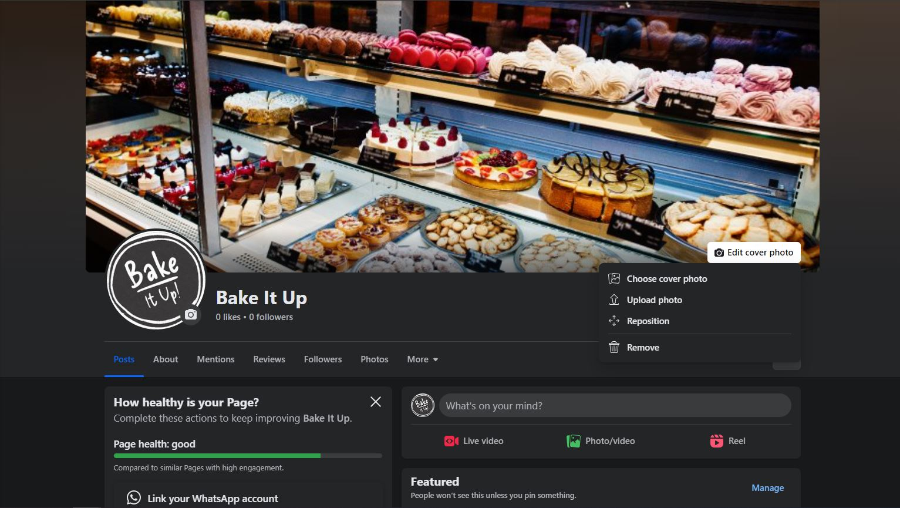

11. After reviewing the finished product, I noticed the cover photo was of low quality, and appeared blurry scaled up to fit its dimensions, so I chenaged it to a more fitting image

12. To add a post, simply click the "What's on your mind" input at the top of the page body, and a popup will appear for you to enter the text content of the post. You also have the option to attach an image, video, location and a lot more. I decided to add an image of the cupcakes that can be found on the website, with a text body promoting these treats, and a link to find them

13. Once you are happy with your post, click the "Post" button and the post will be visible to the public.

<strong>Instagram Page</strong>

Along with a Facebook page, I also created an Instagram page for Bake It Up. Instagram is a suitable platform for the company as it is centered around visual media, i.e. images and videos. A picture is worth a thousand words, and Bake It Up's products speak for themselves.

The steps to create an Instagram page are as follows:

1. Navigate to [Instagram](https://www.instagram.com/). Here, you will be requested to give your login details, or be allowed to create a new account. We want to create a new account, so click the "Sign Up" button at the bottom of the form.

2. On the signup form, you can choose to create an account using your Facebook account, or manually enter your details in the form below. You must provide a name, email, username and password. Once the company's details have been provided and are valid, click "Next".

3. The next step is to provide a date of birth. Instagram requires this, even if the account is for a business.

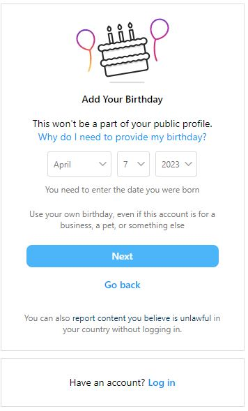

4. Once this is provided, Instagram will send a confirmation email to the email address that was provided on the signup page. Navigate to your emails and find the email to gain access to the confirmation code included in it. This code can be entered to gain access to the account.

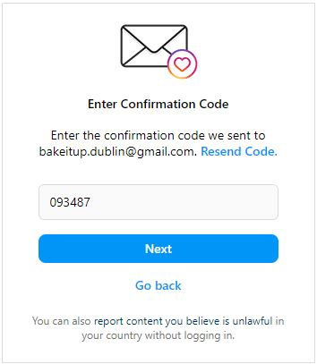

5. Once you have entered the correct code, the account will be created and you will be redirected to the account's main page. It looks bare at the moment, so it will be more populated in the next few steps

6. Beside the username, there is a button to edit the profile. Click that to go to the edit profile page. Here, you can add a profile photo and a bio. There is also an option to add a website, but that is only available on the mobile app. This is a questionable feature, but I implemented the link to the website separately on the app.

7. To add a post, click the "Create" tab in the side navigation on the home page, and a popup will appear allowing you to add photos, videos, or both

8. Once you have added your media, you can move on to the next section, which is to add a filter to the image. I decided to use the no filter the coffee slice looked aesthetically pleasing enough.

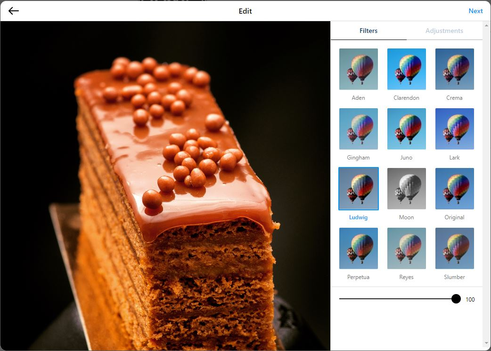

9. When you have chosen your preferred filter, the final step is to add a caption to the post. There is also an accessibility option akin to the "alt" attribute found in image tags. It is vital to include this to allow accessibility for users with visual impairments to interact with your posts

10. On completing this step, a popup message will appear indicating the creation of the post

The final Instagram page looks like this

## Agile Methodologies

Bake It Up was developed using an Agile methodology

- All areas of the site were planned out in the beginning of the development, in the form of *user stories*, which are abilities that users of the site are able to use

- Contrary to a standard task found in waterfall development, a user story also explains the purpose of that task, and why it would be useful for a user of the site. It takes the form of:
  > *"As a **role**, I can **ability** so that **purpose**"*
  Where:
    - **Role**: The type of user engaging with the site. I mainly used "User" (meaning customer) and "Site Administrator" (meaning person(s) responsible for running the site)
    - **Ability**: The feature of the site the user story is referring to. For example: "View my shopping cart"
    - **Purpose**: The reason the feature should exist. If no valid reason can be found, then the time spent implementing this feature could be better spent elsewhere. For example: for my "View my shopping cart" ability the purpose would be that "I can see all the products I have ordered"

- User stories also have other properties, such as:
  - **Epics**: This is a form of grouping of similar user stories. For example: the user story "Log in to my account" would belong to the epic "Authentication". Epics were assigned to user stories through the use of *orange* coloured labels
  - **Themes**: This is a more broad type of user story grouping, which groups epics together. For example, the epic "Authentication" would belong to the theme "Accounts". Themes were assigned to user stories through the use of *cyan* coloured labels
  - **Story Points**: These are numbers assigned to user stories that give a rough estimation of how long it would take to complete that user story. There is no fixed time to measure these points, but instead, the best method would be to compare them to other user stories. Story points were assigned to user stories in the form of *green* coloured labels

- The development cycle of the website was broken down into week-long timelines called *iterations*. Each iteration had a set list of user stories that were aimed to be completed by the end of that iteration
- Each user story assigned to the iteration was given one of three labels:
  - "Must Have": This user story is required to be completed during this iteration
  - "Should Have": This user story is not required, but it is recommended to complete this within the iteration
  - "Could Have": This user story is not required, but if all other user stories are completed, try to complete these
- "Must Have" user story points must not exceed 60% of the total amount of story points in an iteration
- Bake It Up took 6 iterations to complete all the user stories

View all iterations for Bake It Up

  ### Iteration 1
  
  
  ### Iteration 2
  

  ### Iteration 3
  

  ### Iteration 4
  

  ### Iteration 5
  

  ### Iteration 6
  

- Some user stories had an extra label, "NINTH" (short for Not Important, Nice To Have), which was reserved for extra features that were not fundamental to the website

- Throughout the development process, some of these "NINTH" user stories were decided to be removed outright from the final project. Instead of deleting these, I decided to label these user stories with the label "Won't Have", meaning they would not be implemented into the final product

## Data Models

### CRUD Functionality

<strong>Products</strong>

- Admins can add products to the database in the "Add Product" page, found within the profile dropdown. Products can have a lot of different attributes, so I deemed having a user interface to handle these complexities absolutely necessary
- Here, users can enter the fundamental information, such as the product's name, category, description, price, ingredients and image.
- This property form makes a complex system fairly intuitive for new administrators, allowing them to create and update products with ease

- Products also give the option to add custom properties. These properties depend on the category that has been selected for the product
- Properties that are not enabled are hidden by default. This allows the user to expand the properties one by one, and get a feel of how to interpret the property forms. If all the properties started out expanded, it results in a plethora of information being thrown at the admin all at once.
- Bread products have 3 properties:
  - Shape
  - Size
  - Contents
- Pastry products have 6 properties:
  - Type
  - Contents
  - Colour
  - Icing
  - Decoration
  - Text

- When a user checks one of these checkboxes, a collapse expands beneath it, revealing a label input and a property list, with the option to add more properties

- Properties have a default label attached to them. However, properties can take many forms, so there is an option to replace the default label with a custom one. This opens the door to many possibilities to have different properties for different products

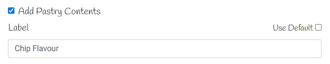

- Values can be added to properties by entering the name of the value and pressing the "Add" button
- When a value is added, it is added to the list of values in that property

- The "Colour" property uses a similar method of adding properties, but looking visually different
- This property uses the same colour picker as the one found in the product detail page, allowing the admin to get a feel of how the finished product would look
- Colours can be added by selecting a colour and clicking "Add"

- Colours can also be selected, and updated or removed from the list. This allows the admin to correct any mistakes they may have made

- Making the colour completely black indicates a "No Colour" value, allowing the colour input to be optional for the user

- Some properties have pre-existing values attached to them, allowing common values to be ready to go and not have to be repeatedly entered.
- This is done using the *SiteData* model in the database. This model stores a list of default properties, separated by a "|" symbol. I decided against adding CRUD functionality to this without access to the admin panel as the process is straightforward, and is more suitable for the role of the site owner, preventing an excess of default values to be entered by several admins
- Existing properties can be removed by clicking on the "x" button to the right of each property
- The "No colour" property exists as a default colour value. When clicked on, the colour input changes to black, informing the user that they have to enter a black colour to get this value

- There is no limits to the amount of values a property can have. This is intentional as Bake It Up wants the same freedoms for the users to create as they can when ordering in store. On top of that, admins are the only users who have this capability, so the public cannot exploit this

- The "Edit Product" page uses an exact copy of this page, except all the previous information of the product is filled in on page load

- Admins can access this page through clicking the "Edit Product" link in the product details page of the product they wish to edit
- Beside this link, there is another link for admins to delete the product. The defensive modal kicks in, requesting assurance that the admin really wants to delete this product, preventing accidental deletion of any products

## Testing

### Manual Testing

Due to the excessive number of tests performed on this site, the testing can be found [here](TESTING.md)

### Automated Testing

#### The add_to_cart function

- For the purposes of demonstration, the function add_to_cart in the cart/cartfunctions.py file was automatically tested using Unittest.
  - *What does this function do?*: This function takes an object containing the details of an ordered product and appends it to the shopping cart object in session storage. Each product order object contains the product's name, any custom properties and the quantity of the product ordered. If there is already an object in the cart with the exact same properties as the new product (besides the quantity), then instead of the object being added to the list, the quantity of the new object will be added to the quantity of the old object
  - *What parameters does it take?*:
    - product (Type: Dictionary): The product to be appended to the shopping cart. Must contain values "name" and "quantity". Every other value is optional
    - cart (Type: List): A list of all products currently in the cart
  - *What does it return?*: It returns a variable of type *list*, which is basically the cart but with the product appended to it
- The test cases for this function are as follows:
  - Returns a TypeError when product is not of type dict
  - Returns a TypeError when cart is not of type list
  - Returns a KeyError when no key "name" is found in product
  - Returns a KeyError when no key "quantity" is found in product
  - Returns a TypeError when value of product "name" is not String
  - Returns a TypeError when value of product "quantity" is not Integer
  - Returns a ValueError when "quantity" value is less than 1
  - Function returns a value of type List
  - product parameter exists in returned list
  - Return value length is one larger than cart parameter length if product is not found in cart
  - Return value length is the same as cart parameter length if product is found in cart
  - Return value length is the same as cart parameter length if product is found in cart, but quantities are different
  - Adds the quantity values together if product is found in cart
  - Products with extra keys are counted as different from products of the same name without them
- *Note*: Because the cart is just a list of previously validated product objects, validation for every item in the cart list is not necessary

#### Red, Green, Refactor

- This is the method used in automated testing, where the code is tested before the code for the test is written, knowing the test will fail.
- After it fails, the bare minimum code is then written to make the test pass.
- Then, if any repeating lines of code are present, the next phase is to refactor that code to make it more efficient
- In my opinion, I dislike this method of testing, as I find it slower and less efficient than testing my code visually, but I included it as a learning experience

#### The Tests

<strong>Test Case 1</strong>

> Red

- 

> Solution

- 

> Green

- 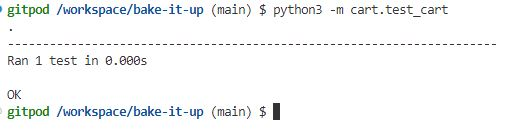

<strong>Test Case 2</strong>

> Red

- 

> Solution

- 

> Green

- 

<strong>Test Case 3</strong>

> Red

- 

> Solution

- 

> Green

- 

<strong>Test Case 4</strong>

> Red

- 

> Solution

- 

> Green

- 

<strong>Test Case 5</strong>

> Red

- 

> Solution

- 

> Green

- 

<strong>Test Case 6</strong>

> Red

- 

> Solution

- 

> Green

- 

<strong>Test Case 7</strong>

> Red

- 

> Solution

- 

> Green

- 

<strong>Test Case 8</strong>

> Red

- 

> Solution

- 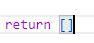

> Green

- 

<strong>Test Case 9</strong>

> Red

- 

> Solution

- 

> Green

- 

<strong>Test Case 10</strong>

- This test immediately passed without having to change the code

<strong>Test Case 11</strong>

> Red

- 

> Solution

- 

> Green

- 

<strong>Test Case 12</strong>

> Red

- 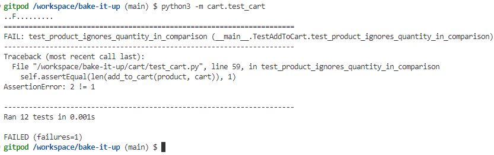

> Solution

- 

> Green

- 

<strong>Test Case 13</strong>

> Red

- 

> Solution

- 

> Green

- 

<strong>Test Case 14</strong>

- This test immediately passed without having to change the code

- 

### Browser Testing

Bake It Up's website was tested in Chrome, Firefox and Microsoft Edge. On all sites, everything is working as normal, and all the files and fonts are loaded correctly

<strong>Google Chrome</strong>

<strong>Firefox</strong>

<strong>Microsoft Edge</strong>

### Error Handling

#### 404 Page

- If a page that has been requested by the user is not found, they are instead redirected to a 404 page, where they are notified that what they are looking for doesn't exist, or has existed before but has been deleted
- Users are then given a link to return to the home page, so they are not left stuck at an error page and are directed back to the site flow

#### 500 Page

- 500 errors will result in the user taken to a 500 error page, which takes a similar form to the 404 page
- However, any errors found in the program will be sent to the admins through the store contact messaging system. This allows for a quick response to any errors found within the site, as the admins can contact the active developer and report the issue
- To test this, I will type the code snippet `hello.world()` into the home page view. "hello" is not defined anywhere in the program, resulting in an error

- The error successfully results in the user being redirected to the 500 page, with a brief paragraph explaining that the staff have been notified of the issue
- The paragraph ends with a link to return to the home page, in a similar fashion to the 404 page
- No details are given about the error in the 500 page. This is done to prevent any private information, such as environment variables in use in the code, becoming exposed the public, as well as preventing the confusion of users who would have no idea how to interpret the error

- Meanwhile, on an admin account, a message notification has appeared in the top right of the profile dropdown. This message is about the error we just experienced.
- Once the admin views the message, the error gives a basic description of the error, giving the receiver the view where it happened and the error message
- At this point, the site owner can contact the developer and the issue can be solved with haste

## Validation

### W3C HTML

### W3C CSS

<strong>style.css</strong>

<strong>home.css</strong>

<strong>products.css</strong>

<strong>cart.css</strong>

<strong>checkout.css</strong>

### JSHint

<strong>script.js</strong>

<strong>modal.js</strong>

- The warning isn't a concern as there is no unwanted properties in the prototype

<strong>products.js</strong>

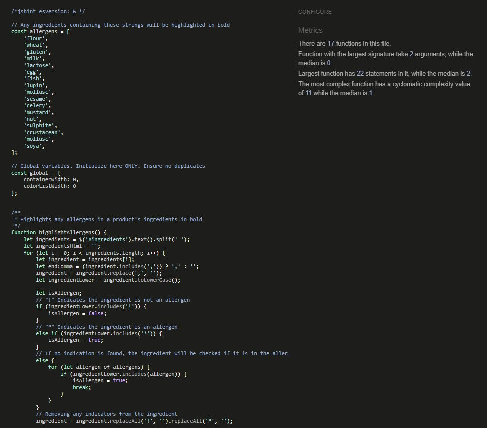

<strong>checkout.js</strong>

<strong>profiles.js</strong>

<strong>contact.js</strong>

<strong>orders.js</strong>

<strong>add_product.js</strong>

- The warnings are being caused by a hexToRgb function I imported from [here](https://stackoverflow.com/questions/5623838/rgb-to-hex-and-hex-to-rgb). It works fine so I don't see it as a major issue

### PEP8

### Lighthouse

### WebAIM Colour Contrast

User Interface Contrast

Call To Action Button Contrast

UI Success Contrast

UI Info Contrast

UI Warning Contrast

UI Error Contrast

## Deployment and Local Development

### Deployment to Heroku

This website was deployed to Heroku. The steps to deploy are as follows:

1. Navigate to [Heroku](https://heroku.com/) and log in.
2. Once logged in, click "New" and then "Create new app"

3. Enter a name for your app, and your region. Note that names must be unique

4. Once that is entered, navigate to the "Settings" tab and scroll down to "Config Vars". Click "Reveal Config Vars" and enter all of your environment variables here. **Don't forget to move all environment variables out of the project's code and into your env.py file before pushing to GitHub!**

5. Once that is done, navigate to the "Deploy" tab, scroll to "Connect to GitHub". Assuming you are logged in with your GitHub account, search for the repository name of your project and select it.

6. To deploy the project click "Deploy Branch" and wait for Heroku to set the project up. Keep an eye out for error logs

- To set the project up to deploy automatically every time changes are pushed to GitHub, you can click "Enable Automatic Deploys" situated above the "Deploy Branch" section. I decided against using this, as the site is connected to Amazon Web Services, and constantly deploying results in a greater usage of credits used, resulting in the billing increasing

### Cloning Repositories

The site was cloned onto my desktop. The steps to clone are as follows:

1. In the GitHub repository, click on the green button that says "Code".
A drop-down menu will appear
2. In the "Local" tab of the drop-down, there will be a link under the "HTTPS"
section. Click the copy button to the right of the link.
3. In the search bar of your PC desktop, search for terminal and open.
4. Type the following command:
`git clone https://github.com/ShaneByrne0963/bake-it-up.git`
5. The site will be cloned to your desktop.

### Forking Repositories

The site was created using a forked repository created by Code Institute. This
repository can be found
[here](https://github.com/Code-Institute-Org/ci-full-template).

The steps to fork are as follows:

1. Navigate to the page of the repository you wish to fork.
2. Click on the green button that says "Use this template". A drop-down will
appear underneath, and select "create a new repository"
3. Enter a repository name where specified.
4. Ensure the site is set to public
5. Click "Create repository from template". GitHub will begin to build a
new project from that template.

## Other Points to Note

### Spelling

- Throughout the development of the project, I used 2 different ways of spelling for some words:
  - **The Engligh spelling** (for example, "colour") is used for anything on the front-end of the site that could be visible to the user. This was done because the website belongs to an Irish company, so its users would be more inclined to spell in this manner
  - **The American spelling** (for example, "color") is used for naming variables. This was done in case the website was handed over to an American or non-fluent English speaker, both more inclined to use this spelling. This would prevent confusion when searching for these variables

### Daylight Savings Time

- When developing the next day baking cutoff point, when testing the feature it worked as intended. However, when the clocks went 1 hour ahead for daylight savings, the time became out of sync with Python's time.
- This seems like this is an issue that is not on my end, as I tried to resolve this by using Django's timezone module, ensuring my timezone settings were correct in my settings file, with no change in result
- This oddity is also present on Stripe's webhook times on their website, so I'm not the only one experiencing this
- To work around this, I added an environment variable "USE_DAYLIGHT_SAVINGS", that, if the issue is resolved, I will remove to ensure the time is synchronised without altering the project

## Credits

### Code Snippets/Tutorials

- [Adding first and last name fields to signup form](https://www.geeksforgeeks.org/python-extending-and-customizing-django-allauth/)
- [Get queryset of generic listview](https://stackoverflow.com/questions/52510586/how-to-filter-a-generic-listview)
- [Remove the number input spinner](https://stackoverflow.com/questions/3790935/can-i-hide-the-html5-number-input-s-spin-box)
- [Chaining 2 model sets together](https://sentry.io/answers/combine-querysets-django/)
- [sorted() function](https://stackoverflow.com/questions/22286610/sort-two-joined-querysets-django)
- [Checking if a model has an attribute](https://stackoverflow.com/questions/610883/how-to-check-if-an-object-has-an-attribute/610923#610923)
- [Python enumerate](https://realpython.com/python-enumerate/#:~:text=Use%20enumerate()%20to%20get,enumerate()%20with%20conditional%20statements)
- [Style Chrome's autocomplete input](https://stackoverflow.com/questions/2781549/removing-input-background-colour-for-chrome-autocomplete)
- [Manually logging out](https://stackoverflow.com/questions/25251719/how-can-i-logout-a-user-in-django)
- [Hex to RGB in JavaScript](https://stackoverflow.com/questions/5623838/rgb-to-hex-and-hex-to-rgb)
- [JavaScript viewport](https://stackoverflow.com/questions/11309859/css-media-queries-and-jquery-window-width-do-not-match)

### Media

- [Gluten-Free Bread](https://www.kingarthurbaking.com/sites/default/files/styles/featured_image/public/2023-07/GF-Bread-Flour-GF-Artisan-Bread-0024.jpg?itok=-FrZF6RJ)
- [Cream Cake](https://e8e9e5q5.rocketcdn.me/wp-content/uploads/2021/11/Fresh-Cream-and-Fruit-2023.jpg)
- [Coffee Cake](https://thenaturalbakery.ie/wp-content/uploads/2021/12/IMG_8617.jpg)
- Hero Image was taken from ShutterStock
- All other images are from Pexels